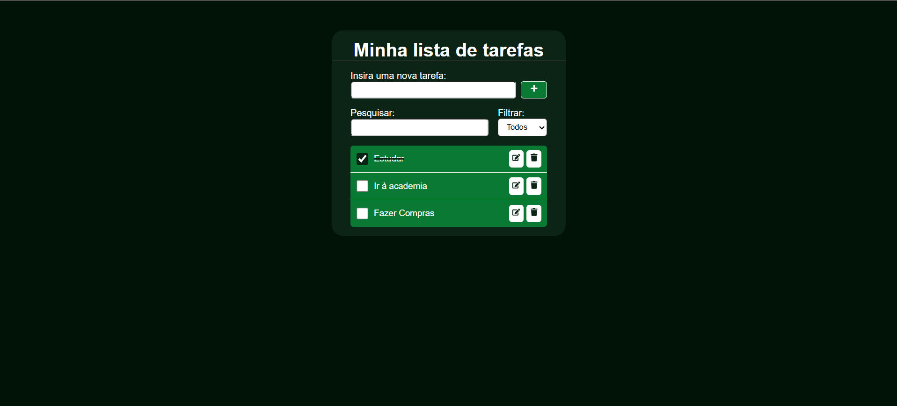

# 📝 To-Do List

Aplicação de lista de tarefas desenvolvida com React, permitindo criar, visualizar, editar, concluir e remover tarefas.

O projeto foi desenvolvido com o objetivo de praticar conceitos fundamentais do React, como componentes, estados, props, eventos e persistência de dados utilizando LocalStorage.

## 🖥️ Preview

🔗 [Acessar aplicação](https://cristianomattoss.github.io/todoList/)


## 🚀 Tecnologias

- React
- JavaScript
- Vite
- CSS
- LocalStorage
- React Icons

## 📋 Funcionalidades

- ✅ Criar tarefas
- 📋 Listar tarefas
- ✔️ Marcar tarefas como concluídas
- ✏️ Editar tarefas
- 🗑️ Remover tarefas
- 🔎 Pesquisar tarefas
- 🔽 Filtrar tarefas por status
- 💾 Persistir tarefas no LocalStorage

## 🧠 Conceitos praticados

Durante o desenvolvimento foram praticados conceitos como:

- Componentização
- `useState`
- Props
- Renderização de listas com `map()`
- Renderização condicional
- Eventos (`onClick`, `onChange`)
- Manipulação de arrays
- `map()`, `filter()` e `splice()`
- Spread Operator (`...`)
- JSON (`JSON.stringify()` e `JSON.parse()`)
- LocalStorage
- Organização de componentes

## 📁 Estrutura do projeto

```text
src/
├── components/
│   ├── CreateTask.css
│   ├── CreateTask.jsx
│   ├── EditTask.css
│   ├── EditTask.jsx
│   ├── ListTask.css
│   └── ListTask.jsx
│
├── App.css
├── App.jsx
├── index.css
└── main.jsx